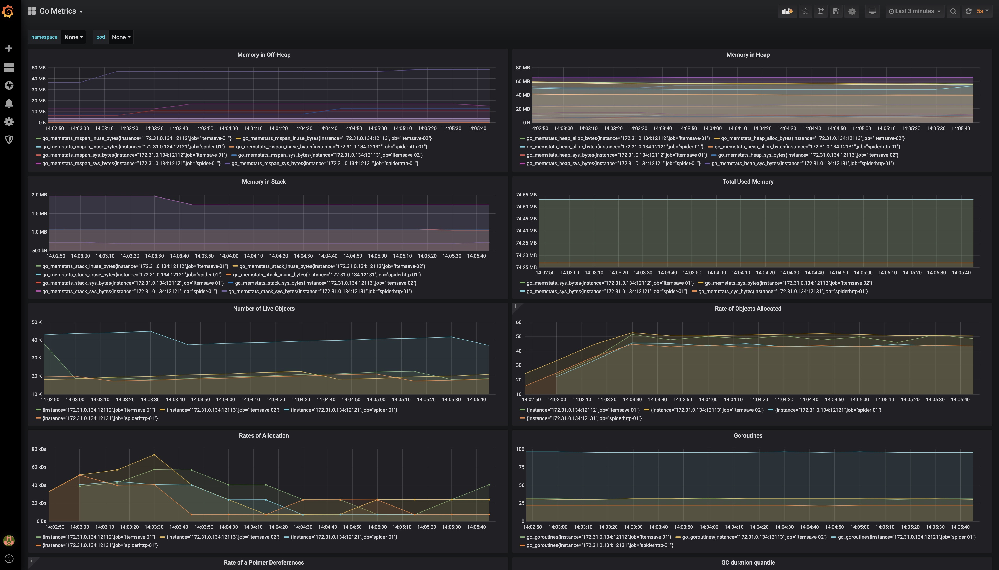
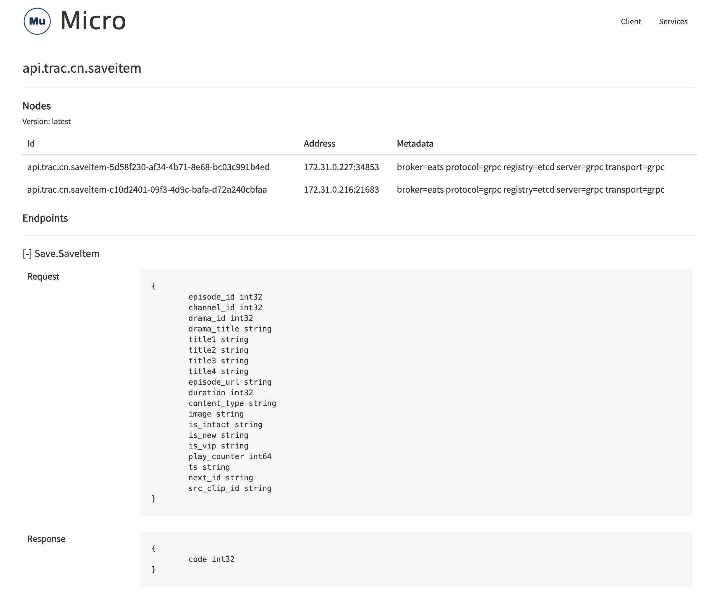
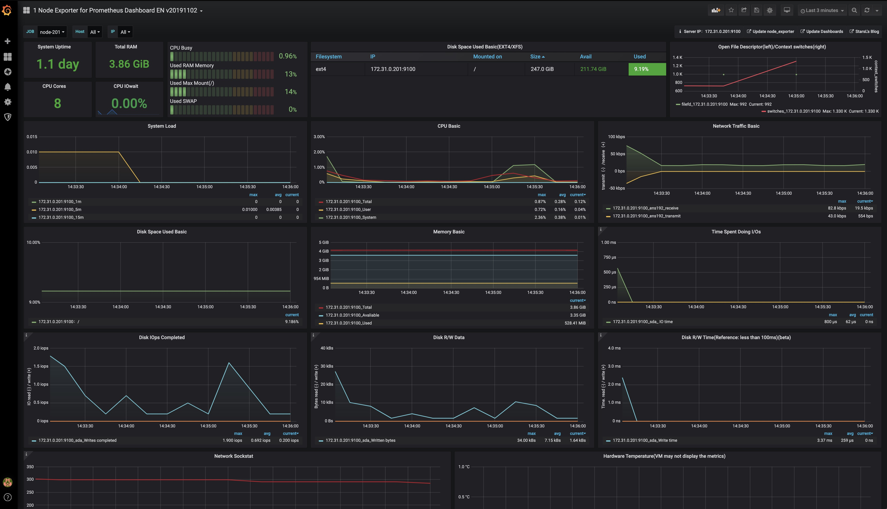

# Go-Spider

爬取 芒果TV 剧集

---
每分钟自动注入一次 seed, 根据 seed 爬取相关网页数据(广度优先)。

通过控制 url 去重时间(seed 也是 url), 控制采集频次。

---
基于 go-micro 微服务框架
(引用包中适配 freebsd 时使用了一些 C 代码，CGo 和 跨平台编译不共存，暂时只能提供 linux 版本的二进制文件)

## 功能描述
+ spider: 负责采集数据，从 etcd 获取 itemsave 服务列表，将采集的数据投递给 itemsave (grpc)
+ itemsave: 注册服务至 etcd，接收 spider 投递的数据存入数据库(mysql)中
+ micro: 第三方工具包，etcd 可视化，查看 itemsave 服务状态 (https://github.com/micro/micro/releases 建议 v2.5.0)
+ etcd: 注册中心 (https://github.com/etcd-io/etcd/releases 建议 v3.4.x)
+ spiderhttp: 手工采集接口，提供 http 接口(后续可能提供 grpc 接口)，解决紧急采集剧集的需求(自动采集有一定的延迟)
+ prometheus: 应用程序状态监控(https://github.com/prometheus/prometheus/releases 建议 v2.18.x)
+ grafana: 可视化 (https://github.com/grafana/grafana/releases 建议 v6.7.x)
+ jaeger: 链路追踪 (https://github.com/jaegertracing/jaeger/releases  建议使用 v1.17.x jaeger-all-in-one)
+ jaeger-ui: 链路追踪可视化，如果用 jaeger-all-in-one 则无需单独启动 (https://github.com/jaegertracing/jaeger-ui)

其他说明:
+ 数据库 schema 在 `docs/sql` 中
+ grafana 配置在 `docs/grafana/bas-spider-metrics.json`
+ 默认情况下，日志文件在 `runtime` 下 
+ swagger UI 仅开发模式需要，`server.RunMode` 改为 `debug` 即可开启。 开启后访问 `http://YOURIP:PORT/swagger/index.html`


---
## 编译
### 爬虫编译
+ dev: `go build`
+ linux: `env GOOS=linux go build`

生成二进制文件 `spider` 在工作目录

### ItemSave 编译
+ dev: `go build ./services/itemsave`
+ linux: `env GOOS=linux go build ./services/itemsave`

生成二进制文件 `itemsave` 在工作目录

### SpiderHttp 编译
+ dev: `go build ./services/spiderhttp`
+ linux: `env GOOS=linux go build ./services/spiderhttp`

生成二进制文件 `spiderhttp` 在工作目录

---
## 配置文件
配置文件位置: `conf/app.ini`

生成配置文件: `cp ./conf/app.dist.ini ./conf/app.ini`

### 最小修改

#### itemsave
只有 itemsave 需要数据库

database
+ User: 数据库用户名
+ Password: 数据库密码
+ Host: 数据库host+port
+ Name: 数据库名称
+ TablePrefix: 数据库表名前缀

server
+ RegistryAddr: 注册中心地址
+ MetricsPort: expose Prometheus metrics (如果部署在同一台机器，注意端口不要和其他服务相同)
+ JaegerAgentAddr: Jaeger agent 地址 (如果有防火墙，请注意此端口需要 UDP)

#### spider
spider 无需配置数据库

server
+ RegistryAddr: 注册中心地址
+ UrlExpire: 控制采集频次，单位为 分钟
+ MetricsPort: expose Prometheus metrics (如果部署在同一台机器，注意端口不要和其他服务相同)
+ JaegerCollectorAddr: Jaeger collector 地址

#### spiderhttp
spiderhttp 无需配置数据库

server
+ RegistryAddr: 注册中心地址
+ RunMode: 正式环境改为 `release`
+ HttpPort: http 服务的端口
+ MetricsPort: expose Prometheus metrics (如果部署在同一台机器，注意端口不要和其他服务相同)
+ JaegerCollectorAddr: Jaeger collector 地址

---
## 部署
1. 启动 `etcd`
2. 启动 `micro` 可视化服务
3. 启动 `itemsave` (可多台，支持水平扩展)
4. 启动 `spider` (目前建议一台，支持水平扩展)
5. 启动 `spiderhttp` (目前建议一台，支持水平扩展)
6. 启动 `prometheus` 采集 go 应用程序数据
7. 启动 `grafana` 展示 prometheus 采集的数据

### etcd

参考: https://github.com/etcd-io/etcd/releases

### micro
将 YOURIP 替换成 etcd 的 ip
`micro --registry=etcd --registry_address=YOURIP:2379 web`

### itemsave
修改配置文件的 `server`(只需配置注册中心地址即可) 和 `database`

启动成功后，在 `micro` 提供的 web 界面中能看到此服务

### spider
修改配置文件的 `server`

启动成功后，会向 `itemsave` 投递数据，每投递1万条，会写一次 log(log 无需保存)

### spiderhttp
修改配置文件的 `server` (只需配置注册中心地址和http配置)

启动成功后，接收http请求，采集指定芒果剧集，向 `itemsave` 投递数据

### prometheus

采集配置

prometheus.yml

```yaml
scrape_configs:
- job_name: itemsave-01
  scrape_interval: 10s
  static_configs:
  - targets:
    - localhost:12112

- job_name: itemsave-02
  scrape_interval: 10s
  static_configs:
  - targets:
    - localhost:12113

- job_name: spider-01
  scrape_interval: 10s
  static_configs:
  - targets:
    - localhost:12121

- job_name: spiderhttp-01
  scrape_interval: 10s
  static_configs:
  - targets:
    - localhost:12131

```

### grafana
连接 prometheus 后，导入 `docs/grafana/bas-spider-metrics.json` 中的配置 



---
## 数据流向(用途描述)
数据流向:
1. spider 采集，投递给 itemsave
2. itemsave 写入 mysql
3. cpanel 上的脚本定时读取 mysql 数据生成索引 (用于定向剧集), 写入 redis
4. dsp 读取 redis 中的剧集索引，指导广告投放

http服务:
1. 接收请求中的 mgtv_url
2. 采集剧集信息，投递给 itemsave

---
## micro web
micro


itemsave


 
---
## todo
- [x] etcd 服务注册/发现
- [x] micro 健康检查
- [x] prometheus 监控应用状态
- [x] grafana 监控可视化
- [x] jaeger 微服务链路追踪
- [x] jaeger-ui 微服务链路追踪可视化
- [x] prometheus 监控 rpc server latency
- [x] hystrix 熔断器 (spider 使用)
- [x] uber.ratelimiter 限流 (itemsave spiderhttp 使用)
- [x] 提供手工采集的接口
- [x] itemsave 接口 (grpc => api)
- [ ] apollo/nacos 配置中心
- [ ] error 日志收集
- [ ] Testing: Unit Testing, Behavior Testing, Integration Testing


### prometheus 监控
- [ ] channel 数据长度
- [ ] QPS
- [ ] 警报(特殊情况发生时，微信推送消息)


### apollo/nacos 配置中心
- [ ] 规划项目中的配置策略
- [ ] 使用配置中心后的程序初始化(平滑启动)
- [ ] 集成 ORM
- [ ] 集成 go-micro gin中间件
- [ ] 重载策略: 服务降级


## 异步消费 
(已尝试，暂时不启用)
- [x] rabbitmq/redis broker 


---
## 非必须(建议)
+ node_exporter: 采集 (https://github.com/prometheus/node_exporter/releases 建议 v0.18.1)


### node_exporter
参考 (https://github.com/prometheus/node_exporter)


#### prometheus

采集配置

prometheus.yml

```yaml
scrape_configs:
- job_name: node-201
  scrape_interval: 10s
  static_configs:
  - targets:
    - 172.31.0.201:9100

```


#### grafana
连接 prometheus 后，导入 `docs/grafana/node-exporter.json` 中的配置 




